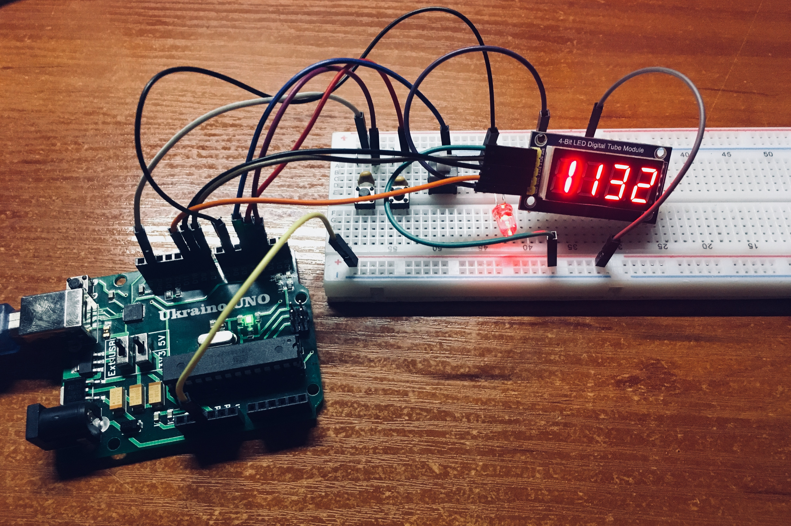

 AVR digital watches
---------------------------------------------------------------------------------

Our device has an ability to calculate real time **(24/7)**.

Dynamic indication - the most usefull advantage. DI has been designed by [this guy](https://github.com/thodnev).

The clock generator makes possibly to calculate time exact.

Also the device has an **alarm mode**.

You will be able to set local time and alarm by 3 buttons.

### Pinout
- **D10** - DIO
- **D9**  - RCLK
- **D8**  - SCLK
- **D6**  - Indicator with 500-1000 Om
- **D4**  - Button for alarm mode(without clamping)
- **D3**  - Button (clocked) for minutes
- **D2**  - Button (clocked) for hours
- **GND** - GND
- **5V**  - VCC

 **Use ceramic capasitors for buttons!**

## Run
- make hex
- make flash

### Clean
- make clean

## Demostration:

